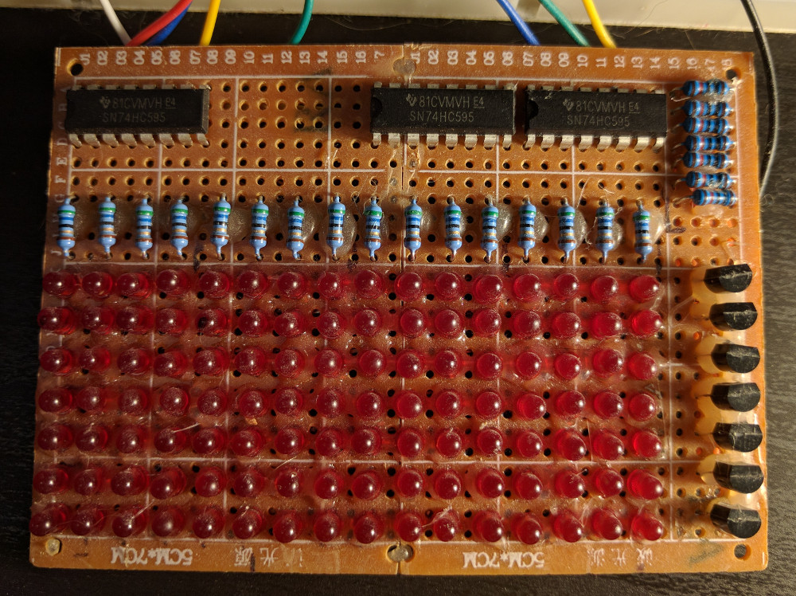
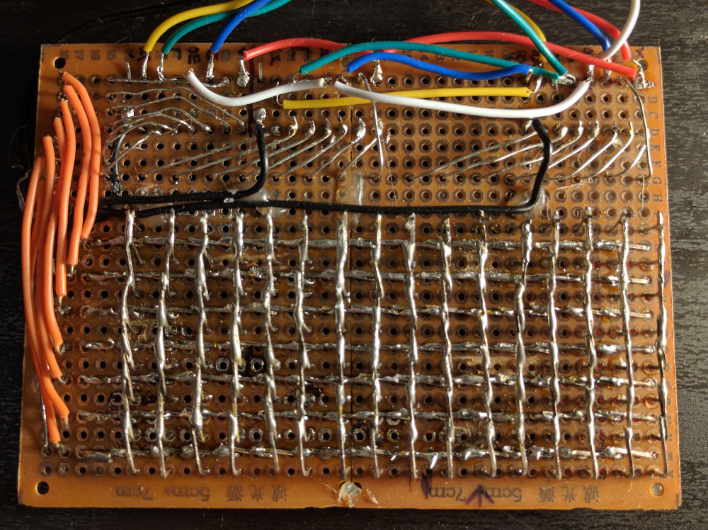
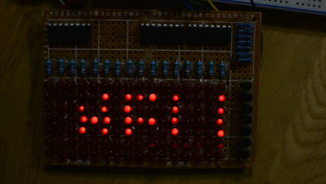

# led-matrix
Python script for a small LED matrix display

## Why?

I found a bunch of old LEDs lying around and wanted to learn some soldering, so I decided to make a LED matrix display. 

## How?

The grid of LEDs is controlled by some shift registers and transistors (sorry, no wiring diagram) connected to GPIO pins on a Raspberry Pi. 
A python script using the RPi.GPIO package displays a scrolling "HELLO WORLD!" text on the display.

## What?

The front and back of the LED matrix board:

----

LED matrix in action: (it isn't quite as flickery in person)

